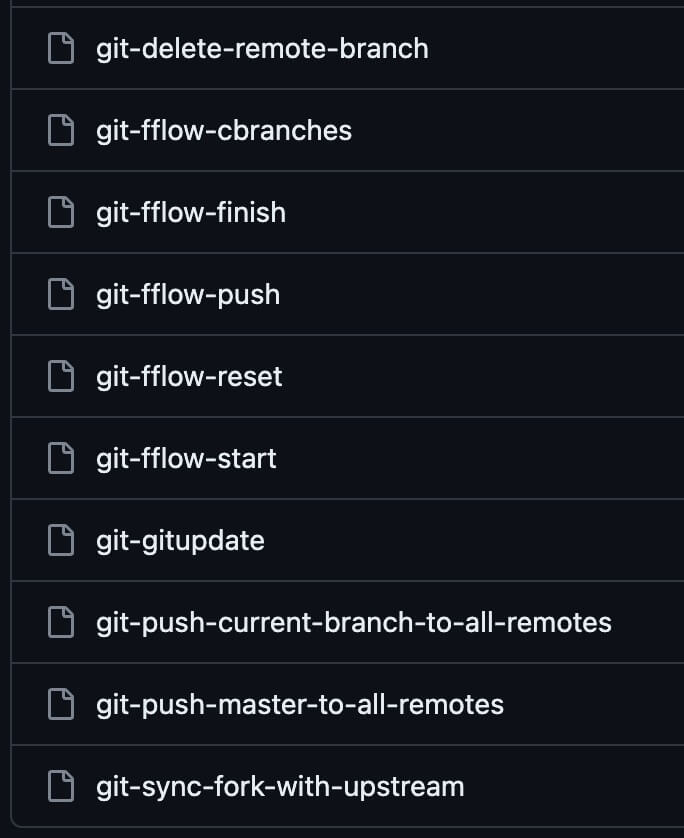

# SourceTree Custom Actions

The commands I'm using to complement SourceTree via Custom Actions



## Installation

Change your current directory to `$HOME/Library/Application Support/SourceTree/`:

```shell
cd "$HOME/Library/Application Support/SourceTree/"
```

So, git clone (or download) this repository there: 

```shell
git clone \
    https://github.com/rogeriopradoj/sourcetree-custom-actions-scripts.git \
    scripts
```

Then, go to SourceTree, `Preferences -> Custom Actions -> Add`, filling the options like this:

- **Menu Caption**: a custom name for that action;
- **[x] Show Full Ouput**: mark it;
- **Script to run**: navigate to `$HOME/Library/Application Support/SourceTree/scripts` folder and pick the one you are setting up;

And it's done! Remember that you need to do this process to each of the scripts you want to use as a Custom Action in your machine.

### Updating

You can download latest zip, or run the following command:

```shell
CWD=`pwd` && \
    cd "$HOME/Library/Application Support/SourceTree/scripts" && \
    git pull && \
    cd $CWD
```

So, you get the latest versions of the scripts.


## Usage

While working in your repositories as normal in SourceTree, go to `Actions -> Custom Actions` and pick the one you want to use.

### Extra - Usage via CLI

I suggest you adding the folder `$HOME/Library/Application Support/SourceTree/scripts/bin` in your `$PATH` environment variable. This way, you can use the same scripts via CLI just calling script name, instead of needing to type the full path to each script.

In case you are using `bash` as your shell, you can do this:

```shell
echo \
    'export PATH=$PATH:"$HOME/Library/Application Support/SourceTree/scripts/bin"' \
    >> ~/.bashrc && \
    source ~/.bashrc
```

Otherwise, here is the syntax if your shell is `zsh`:

```shell
echo \
    'export PATH=$PATH:"$HOME/Library/Application Support/SourceTree/scripts/bin"' \
    >> ~/.zshrc && \
    source ~/.zshrc
```

Remember to make scripts executable:

```shell
find "$HOME/Library/Application Support/SourceTree/scripts/bin/" -type f -print0 | xargs -0 chmod +x
```

After that, you can run any of the scripts via CLI no matter inside what directory you are, example of running `git-push-master-to-all-remotes`

```shell
cd PATH_TO_ANY_GIT_PROJECT
#
git-push-master-to-all-remotes
# or
git push-master-to-all-remotes
```
